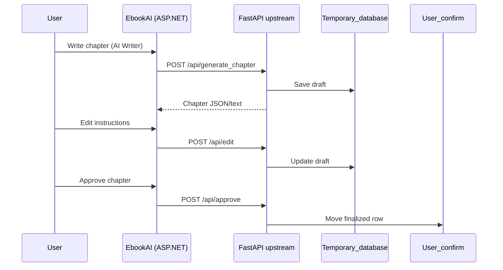

# External Book API — Documentation

Python **FastAPI** upstream used by EbookAI for chapter generation, editing, audio transcription, cover images, and queue monitoring.

| Item | Value |
|------|--------|
| **Base URL** | `http://162.229.248.26:8001` |
| **Authentication** | Header `X-API-Key: <your-key>` on every request |
| **Content-Type** | `application/json` for JSON endpoints; `multipart/form-data` for audio file upload (recommended) |

> **Security:** Never commit API keys to git. On the ASP.NET server set `ExternalApi__ApiKey` in `/etc/default/ebookai`.  
> If a key was shared in chat or email, **rotate it** on the upstream service.

---

## Quick test

```bash
curl -s -H "X-API-Key: $API_KEY" http://162.229.248.26:8001/api/queue-data
```

Interactive examples: [`smoke-tests.http`](../smoke-tests.http) (VS Code REST Client) or:

```bash
python Scripts/smoke_test.py --base-url http://162.229.248.26:8001 --api-key "$API_KEY"
```

Sample payloads: [`Scripts/smoke-payloads/`](../Scripts/smoke-payloads/)

---

## How this connects to the live app

| Layer | URL | Auth |
|-------|-----|------|
| **Upstream (this doc)** | `http://162.229.248.26:8001/api/...` | `X-API-Key` |
| **EbookAI web app (BFF)** | `http://138.197.76.70:5000/Books/...` | User login cookie + session |

The browser calls the **ASP.NET app**, which forwards requests to the upstream with `X-API-Key`.  
Diagnostics on production:

- `GET /health` — app + upstream probe  
- `GET /Books/ExternalApiStatus` — key configured, queue probe (no secret returned)  
- `GET /Books/DeploymentStatus` — DB, uploads, OAuth, env hints  

### BFF → upstream route map (browser never calls upstream directly)

| User action (AI Writer / app) | ASP.NET endpoint (session cookie) | Upstream |
|-------------------------------|-----------------------------------|----------|
| Generate chapter | `POST /Books/AIGenerateBook` | `POST /api/generate_chapter` |
| Edit chapter | `POST /Books/AIEditBook` | `POST /api/edit` |
| Approve / finalize | `POST /Books/ApproveChapter` (and related) | `POST /api/approve` |
| Audio → text | `POST /Books/TranscribeAudio` (multipart) | `POST /api/audio` |
| Queue status | `GET /Books/ExternalApiStatus` | `GET /api/queue-data` |
| Generate cover | Cover API controllers / BookDesign | `POST /api/generate-cover` |
| Edit cover | Cover API | `POST /api/edit-cover` |
| Refine cover prompt | BookDesign | `POST /api/refine_cover_prompt` |
| Suggest chapter names | Books pipeline | `POST /api/book_chapters_name` |
| Suggest cover from highlights | BookDesign | `POST /api/suggest-cover-prompt-from-highlights` |

**Configure the key on the server only** (never in git or this doc):

```bash
# /etc/default/ebookai
ExternalApi__ApiKey="<your-secret-key>"
ExternalApi__BaseUrl="http://162.229.248.26:8001"
```

---

## Endpoints

### 1. Generate chapter

Creates AI chapter prose. Result is stored in **Temporary_database** until approved.

**`POST /api/generate_chapter`**

**Request body**

```json
{
  "user_id": "u123",
  "book_id": "b456",
  "chapter": "18",
  "user_input": "how gravity was discovered"
}
```

| Field | Type | Notes |
|-------|------|-------|
| `user_id` | string | Your user identifier |
| `book_id` | string | Book/project identifier |
| `chapter` | string | Chapter number (upstream expects string, e.g. `"18"`) |
| `user_input` | string | Topic / brief for the chapter |

**Example result (illustrative)**

Generated heading might read like: *"The gravitational force is invented in 8790"* — exact wording depends on the model.

**cURL**

```bash
curl -X POST http://162.229.248.26:8001/api/generate_chapter \
  -H "X-API-Key: $API_KEY" \
  -H "Content-Type: application/json" \
  -d @Scripts/smoke-payloads/generate-chapter.json
```

**Notes**

- Long-running (often 2–8+ minutes). Queue may delay start — check `/api/queue-data` first.
- EbookAI app timeout: configurable via `ChapterGeneration:BrowserFetchTimeoutMinutes` (default ~55 min).

---

### 2. Edit chapter

Applies text changes to a draft chapter in **Temporary_database**.

**`POST /api/edit`**

**Request body**

```json
{
  "user_id": "u123",
  "book_id": "b456",
  "chapter": "18",
  "changes": "replace in heading 8790 with 6789"
}
```

**Example:** If the heading contains `8790` and you want `6789`, set `changes` to something like:  
`"replace in heading 8790 with 6789"` or `"change the title something else"`.

**cURL**

```bash
curl -X POST http://162.229.248.26:8001/api/edit \
  -H "X-API-Key: $API_KEY" \
  -H "Content-Type: application/json" \
  -d @Scripts/smoke-payloads/edit.json
```

---

### 3. Audio transcription

Transcribes voice/audio into chapter text. Stored in **audio_transcriptions** table.

**`POST /api/audio`**

#### Mode A — JSON with server-local path (upstream worker must read the path)

```json
{
  "user_id": "u123",
  "book_id": "b456",
  "chapter": 14,
  "audio_file_path": "C:\\book_project\\Audio_transcribe_into_text\\John s Morning Routi.mp3"
}
```

> Path must exist on the **upstream server**, not the user's PC, unless you use Mode B.

#### Mode B — Multipart upload (recommended via EbookAI app)

Supported formats: `.mp3`, `.mp4`, `.mpeg`, `.mpga`, `.m4a`, `.wav`, `.webm`

Form fields (typical):

| Field | Description |
|-------|-------------|
| `user_id` | User id |
| `book_id` | Book id |
| `chapter` | Chapter number |
| `audio` / `audio_file` / `file` | Binary audio file |

The .NET app tries multiple field names automatically (`ExternalApi:AudioMultipartFieldNames`).

---

### 4. Approve chapter (confirm / finalize draft)

Moves confirmed content from **Temporary_database** → **User_confirm**.

**`POST /api/approve`**

**Request body** (valid JSON — no trailing spaces in keys)

```json
{
  "user_id": "u123",
  "book_id": "b456",
  "chapter": 18,
  "approve": true
}
```

| Field | Type | Notes |
|-------|------|-------|
| `chapter` | number or string | Use `18` or `"18"` — **not** `"chapter "` with a space |
| `approve` | boolean | `true` to confirm |

---

### 5. Queue status

**`GET /api/queue-data`**

No body. Returns concurrency and backlog.

**Example response**

```json
{
  "status": {
    "running": 0,
    "waiting": 57,
    "max_concurrent": 20,
    "total_requests": 77
  },
  "logs": [
    "[18:56:37] 📥 Request added to queue",
    "[19:00:00] ✅ Request finished. Running now: 0"
  ]
}
```

| Field | Meaning |
|-------|---------|
| `running` | Requests currently processing |
| `waiting` | Requests queued |
| `max_concurrent` | Worker concurrency limit |
| `total_requests` | Total tracked requests |
| `logs` | Recent queue events |

If `waiting` is high, POST endpoints may **time out** until the queue drains.

---

### 6. Generate cover (front)

**`POST /api/generate-cover`**

**Request body**

```json
{
  "title": "The Power of Gravity",
  "author_name": "Hasan Rahim",
  "category": "Science",
  "cover_style": "Modern Illustration",
  "size": "1024x1536",
  "quality": "medium"
}
```

**Valid `size`:** `1024x1024`, `1536x1024`, `1024x1536`, `auto`  
**Valid `quality`:** `low`, `medium`, `high`, `auto`

---

### 7. Generate print-ready wrap (spine + back + front)

**`POST /api/generate-spine-book-cover`**

Used for KDP paperback wrap. Extra fields vs front-only cover:

```json
{
  "title": "Peter Pan",
  "author_name": "J. M. Barrie",
  "category": "Children's Fantasy",
  "cover_style": "Victorian ornamental",
  "size": "1536x1024",
  "quality": "high",
  "Interior_trim_size": "6 x 9 in",
  "page_count": 40,
  "paper_type": "white"
}
```

---

### 8. Edit cover image

**`POST /api/edit-cover`**

**Request body**

```json
{
  "encoded_image": "iVBORw0KGgoAAAANSUhEUgAA...",
  "image_direction": "brighter foreground, warmer lighting",
  "size": "1024x1536"
}
```

| Field | Description |
|-------|-------------|
| `encoded_image` | Base64 PNG/JPEG (no `data:image/...` prefix) |
| `image_direction` | Natural-language edit instructions |
| `size` | One of the valid sizes above |

---

### 9. Suggest chapter names from highlights

**`POST /api/book_chapters_name`**

```json
{
  "user_id": "u1",
  "book_id": "b1",
  "highlights": [
    {
      "chapter_name": "Chapter 1",
      "detailed_bullet_summary": "Hero discovers gravity and questions the old laws."
    }
  ]
}
```

Upstream may return suggested names; **`suggest_chapter_name`** column in **Temporary_database** stores up to ~5 suggestions before the user picks a final name.

---

### 10. Refine cover prompt

**`POST /api/refine_cover_prompt`**

```json
{
  "user_prompt": "mystical forest at dawn"
}
```

Returns an improved cover-generation prompt.

---

### 11. Suggest cover prompt from highlights

**`POST /api/suggest-cover-prompt-from-highlights`**

```json
{
  "user_id": "u1",
  "book_id": "b1",
  "highlights": [
    {
      "chapter_name": "Chapter 1",
      "detailed_bullet_summary": "Hero discovers gravity."
    }
  ]
}
```

---

## HTTP status codes

| Code | Meaning |
|------|---------|
| `200` | Success |
| `401` / `403` | Missing or invalid `X-API-Key` |
| `422` | Invalid JSON or validation error |
| `400` | Bad request (e.g. audio path not found) |
| Timeout | Queue backlog or upstream overload — check `/api/queue-data` |

---

## Upstream database tables

### 1. `Temporary_database`

Draft chapters before user approval.

| Column | Type | Description |
|--------|------|-------------|
| `id` | INT PK | Auto increment |
| `user_id` | VARCHAR(255) | User |
| `book_id` | VARCHAR(255) | Book |
| `chapter` | INT | Chapter number |
| `chapter_name` | VARCHAR(255) | Title |
| `user_input` | TEXT | Original prompt |
| `content` | LONGTEXT | Generated body |
| `suggest_chapter_name` | TEXT | Up to ~5 AI-suggested names (user picks one) |
| `highlight_of_previous_chapter` | LONGTEXT | Continuity context |
| `date` | DATE | Default today |
| `time` | TIME | Default now |

### 2. `User_confirm`

Approved / finalized chapters.

| Column | Type |
|--------|------|
| `id`, `user_id`, `book_id`, `chapter`, `chapter_name`, `user_input`, `content`, `highlight_of_previous_chapter`, `date`, `time` | Same pattern as temporary (no `suggest_chapter_name`) |

### 3. `audio_transcriptions`

| Column | Type |
|--------|------|
| `id` | INT PK |
| `date`, `time` | DATE, TIME |
| `user_input` | TEXT — transcription result |
| `book_id` | VARCHAR(50) |
| `chapter` | INT |
| `user_id` | VARCHAR(50) |
| `audio_file_path` | VARCHAR(255) |

### 4. `queue_monitor`

| Column | Type |
|--------|------|
| `id` | INT PK |
| `status_running` | INT |
| `status_waiting` | INT |
| `status_max_concurrent` | INT |
| `status_total_requests` | INT |
| `logs` | TEXT |
| `user_id`, `book_id` | VARCHAR(50) |
| `chapter` | INT |
| `log_date`, `log_time` | DATE, TIME |

### 5. `error_logs`

| Column | Type |
|--------|------|
| `id` | INT PK |
| `line_number` | INT |
| `error` | TEXT |
| `filename` | VARCHAR(255) |
| `error_date`, `error_time` | DATE, TIME |

---

## Typical chapter workflow



---

## Troubleshooting “APIs not working”

### Diagnosis flow (run in order)

1. **BFF health** — `curl http://138.197.76.70:5000/health` → JSON with `status: ok`.
2. **Key configured** — `curl http://138.197.76.70:5000/Books/ExternalApiStatus` → `apiKeyConfigured: true`.
3. **Upstream reachable** — from a host that can reach `162.229.248.26`:
   ```bash
   export API_KEY="your-key-from-/etc/default/ebookai"
   curl -s --max-time 20 -H "X-API-Key: $API_KEY" http://162.229.248.26:8001/api/queue-data
   ```
4. **Queue** — if `waiting` is high and `running` is `0` for several minutes, LLM workers are stuck → restart FastAPI on upstream.
5. **Generate smoke** — `POST /api/generate_chapter` with a short `user_input`; expect **minutes**, not seconds.

| Symptom | Likely cause | Fix |
|---------|--------------|-----|
| Empty response / JSON parse error in browser | Session expired after deploy | Log in again; ensure deploy uses `deploy/link-persistent.sh` |
| `Server configuration error: no API key` | `ExternalApi__ApiKey` missing on server | Set in `/etc/default/ebookai`, restart app |
| Requests hang then fail | Large `waiting` queue on upstream | `GET /api/queue-data`; retry later or scale upstream workers |
| **`waiting` > 0 and `running` = 0** | Workers not processing LLM jobs | SSH to `162.229.248.26`, restart API; inspect `queue_monitor` + `error_logs` |
| `approve` fast but `generate`/`edit` hang | Approve is lightweight; generate/edit wait on LLM queue | Same worker restart |
| `401` on upstream | Wrong or missing `X-API-Key` | Match server env with upstream; **rotate key** if exposed in chat |
| Upstream timeout from your PC | Firewall / server down | On upstream: `curl http://127.0.0.1:8001/api/queue-data` |
| Audio fails with JSON path | Path is on client PC, not server | Use multipart upload through EbookAI |
| Cover edit fails | Invalid base64 or size | Valid `size`; strip `data:image/...` prefix from base64 |

**Production checklist**

```bash
# On EbookAI server
curl -s http://127.0.0.1:5000/health
curl -s http://127.0.0.1:5000/Books/ExternalApiStatus

# On upstream (from a machine that can reach 162.229.248.26)
curl -s -H "X-API-Key: $API_KEY" http://162.229.248.26:8001/api/queue-data
```

---

## EbookAI configuration reference

`appsettings.Production.json` / environment variables:

| Setting | Env variable | Example |
|---------|--------------|---------|
| Base URL | `ExternalApi__BaseUrl` | `http://162.229.248.26:8001` |
| API key | `ExternalApi__ApiKey` | *(secret — not in git)* |
| Generate | `ExternalApi__GenerateUrl` | `.../api/generate_chapter` |
| Edit | `ExternalApi__EditUrl` | `.../api/edit` |
| Approve | `ExternalApi__ApproveUrl` | `.../api/approve` |
| Audio | `ExternalApi__AudioUrl` | `.../api/audio` |
| Queue | `ExternalApi__QueueDataUrl` | `.../api/queue-data` |
| Cover | `ExternalApi__GenerateCoverUrl` | `.../api/generate-cover` |
| Edit cover | `ExternalApi__EditCoverUrl` | `.../api/edit-cover` |
| Spine wrap | `ExternalApi__GenerateSpineBookCoverUrl` | `.../api/generate-spine-book-cover` |

See also: [`DEPLOYMENT.md`](../DEPLOYMENT.md), [`DigitalOcean-EnvironmentVariables.txt`](../DigitalOcean-EnvironmentVariables.txt).
