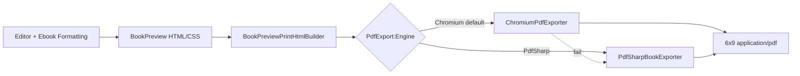

# PDF Export — BookPreview ≡ PDF (WYSIWYG)

**Goal:** Jo user BookPreview / Ebook Formatting mein dekhta hai (fonts, colors, spacing, page background, images) — wahi exact 6×9 KDP PDF export ho.

## Architecture



## Engine choice (recommended: Chromium)

| Engine | NuGet / binary | CSS fidelity | Linux server | Status |
|--------|----------------|--------------|--------------|--------|
| **Chromium** (PuppeteerSharp) | `PuppeteerSharp` + `google-chrome-stable` | Full browser CSS | ✅ Recommended | **Default** |
| **PdfSharp** | `PDFsharp` + `wwwroot/fonts/pdf/*.ttf` | Inline styles only | ✅ No browser | Fallback |
| DinkToPdf / wkhtmltopdf | `DinkToPdf` + `wkhtmltopdf` apt | Weak CSS3 | ⚠️ Old WebKit | Reserved (not wired) |
| IronPDF / SelectPdf / Syncfusion | Commercial | Chrome-like | Paid license | Not integrated |

### Why Chromium over alternatives?

- **IronPDF vs PuppeteerSharp:** Dono Chrome engine use karte hain; PuppeteerSharp free + open-source hai. IronPDF paid license + similar output — performance comparable, PuppeteerSharp sufficient for batch export.
- **SelectPdf vs Chromium:** Layout consistency ke liye real browser print (Chromium) best — SelectPdf commercial, CSS edge cases alag ho sakte hain.
- **DinkToPdf custom fonts:** `@font-face` with absolute `file://` ya base64; `--enable-local-file-access`, `--print-media-type`, `--background`. Hum base64 embed use karte hain (`BuildFontStylesForExport`) — Chromium mein zyada reliable.
- **Syncfusion page breaks:** `page-break-before/after` CSS — hum manuscript HTML mein already use karte hain; Chromium respects these natively.

## NuGet packages

```xml
<PackageReference Include="PuppeteerSharp" Version="20.2.4" />
<PackageReference Include="PDFsharp" Version="6.2.0" />
```

## Configuration

`appsettings.json`:

```json
{
  "PdfExport": {
    "Engine": "Chromium",
    "Margins": {
      "Trim6x9": {
        "Top": "0.5in",
        "Bottom": "0.5in",
        "Inside": "0.375in",
        "Outside": "0.25in"
      }
    }
  },
  "Puppeteer": {
    "ExecutablePath": "/usr/bin/google-chrome-stable"
  }
}
```

| Key | Values |
|-----|--------|
| `PdfExport:Engine` | `Chromium` (default), `PdfSharp`, `DinkToPdf` (falls back to Chromium until wired) |
| `Puppeteer:ExecutablePath` | Chrome/Chromium path on server |
| `PUPPETEER_EXECUTABLE_PATH` | Env override |
| `PdfExport:Margins:Trim6x9` | Override KDP gutter/margins |

## Linux server setup (DigitalOcean)

```bash
apt-get update
apt-get install -y google-chrome-stable
# fonts for PdfSharp fallback:
bash Scripts/download-export-fonts.sh
# deploy
bash deploy/webconsole-deploy.sh
```

Outbound HTTPS: `fonts.googleapis.com` (Google Fonts fallback if local TTF missing).

## Pipeline (code)

1. `InteriorPrintDocumentBuilder.BuildChapterSectionsHtml` — same DOM as preview (`book-preview-sheet`, `reader-chapter-block`, `reader-page-title`, `reader-page-body`).
2. `BookPreviewPrintHtmlBuilder.Build` — full HTML doc with `@font-face`, theme CSS, `reader-content-wrap` + `interior-*` classes.
3. `ChromiumPdfExporter.ExportAsync` — `SetContentAsync(html)`, `document.fonts.ready`, `PrintBackground: true`, 6×9 + margins.
4. On failure → `PdfSharpBookExporter.Render`.

## Fonts

| Font | Interior style |
|------|----------------|
| Merriweather | Novel |
| Playfair Display | Novel headings |
| Inter | Modern, Minimalist |
| Cormorant Garamond | Classic |
| EB Garamond | Elegant Trade body |
| Lora | Elegant Trade headings |

Local TTF: `wwwroot/fonts/pdf/` — download via `Scripts/download-export-fonts.sh`.

`InteriorPrintDocumentBuilder.BuildFontStylesForExport()` injects base64 `@font-face` + Google Fonts `<link>` fallback.

## Page background (cream / off-white)

Per interior via `InteriorExportTheme.ResolveDefaultPageBackground()`:

| Style | Color |
|-------|-------|
| Novel | `#fffdf8` |
| Classic | `#fdfcfa` |
| Elegant Trade | `#fcf9f3` |
| Modern / Minimalist | `#ffffff` |

Override: `pageBackgroundColor` in export request → `BookPdfExportOptions.ResolvePageBackgroundColor()`.

Chromium: `PrintBackground: true` (required).

## KDP 6×9 margins (default)

| Edge | Value |
|------|-------|
| Page size | 6in × 9in |
| Inside (gutter) | 0.375in |
| Outside | 0.25in |
| Top / bottom | 0.5in |

Bleed-heavy platforms (Ingram, Just Print) use slightly larger values — see `BookPdfPlatformLayout.Trim6x9Print`.

## BookPreview UX (no scroll, no last-word cut)

| Location | Fix |
|----------|-----|
| AI Writer | `Views/Books/AIGenerateBook.cshtml` — `getReaderPageMaxHeight`, `splitHtmlIntoReaderPages`, `overflow: hidden` |
| Ebook Formatter | `Views/BookDesign/CoverDesignCalculatorFixing.cshtml` — viewport `overflow-y: hidden`, 6×9 aspect shell, padding-aware `getFmtContentAreaHeightPx` |
| Shared CSS | `wwwroot/css/book-page-preview.css` |

## API endpoints

| Endpoint | Purpose |
|----------|---------|
| `POST /Dashboard/DownloadBookPdf` | Full book PDF |
| `POST /Dashboard/DownloadBookInteriorPdf` | Interior only |
| `POST /Books/DownloadFinalizedChaptersPdf` | Finalized chapters |
| `POST /Books/ExportPrintReadyBundle` | ZIP: PDF + cover PNG |

## Key source files

| File | Role |
|------|------|
| `Services/BookPdfService.cs` | Orchestration |
| `Services/PdfExport/BookPreviewPrintHtmlBuilder.cs` | Preview = export HTML |
| `Services/PdfExport/ChromiumPdfExporter.cs` | PuppeteerSharp |
| `Services/PdfExport/PdfSharpBookExporter.cs` | Fallback |
| `Services/PdfExport/PdfExportEngine.cs` | Engine name resolution |
| `Models/DTO/BookPdfLayoutOptions.cs` | Configurable margins |
| `Services/InteriorExportTheme.cs` | Typography + page colors + `book-preview-sheet` CSS |
| `Services/BookPdfPlatformLayout.cs` | 6×9 vs A4 |

## Memory optimization (ASP.NET PDF)

- Reuse one browser per export (launch → one page → close) — current design.
- For high volume: browser pool singleton with semaphore limit (future).
- Large books: stream PDF bytes directly to response; don't hold HTML + PDF in memory longer than needed.
- Base64 fonts: only fonts under 900KB embedded; rest use Google Fonts.

## Switching engines

1. Set `PdfExport:Engine` in appsettings or environment.
2. **Chromium:** install Chrome, set `Puppeteer:ExecutablePath`.
3. **PdfSharp:** run font download script; limited CSS (no full preview parity).
4. Restart app after config change.

## Troubleshooting

| Symptom | Fix |
|---------|-----|
| Plain text PDF, no colors | Chromium failed — install Chrome, check logs |
| Font substitution warnings | Run `download-export-fonts.sh` |
| White background in PDF | `PrintBackground` must be true (default) |
| Preview OK, PDF different | Ensure `Engine: Chromium`; check `Chromium PDF font status` log |
| KDP margin warning | Adjust `PdfExport:Margins:Trim6x9` |

## Tests

```bash
dotnet test tests/Tests.csproj --filter ManuscriptExportPrepTests
dotnet test tests/Tests.csproj --filter PdfSmokeTest
```
