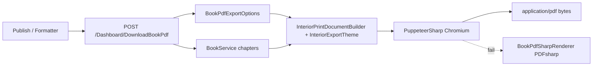

# PDF Export — WYSIWYG Architecture

Production PDF export uses **PDFsharp (primary)** with embedded TTF fonts, 6×9 KDP margins, and HTML style painting. **PuppeteerSharp** remains optional (`PdfExport:Engine`: `Chromium`) for browser-perfect CSS when Chrome is installed.

## Why PDFsharp is primary (your PDF software workflow)

Dedicated PDF tools embed fonts and draw at exact page size — PDFsharp does the same:
- **6×9 inch** page (`432×648` pt) with KDP gutters from `BookPdfPlatformLayout`
- **Fonts embedded** from `wwwroot/fonts/pdf/*.ttf` via `ExportPdfFontResolver`
- **Inline CSS** (`color`, `font-size`, `font-family`) parsed in `ManuscriptHtmlPdfPainter`
- **Page background** fill per interior style (`#fdfcfa`, `#fffdf8`, etc.)
- **Images** embedded from `data:` URLs or https

Chromium HTML-print is optional fallback — on many servers Puppeteer failed and the old plain-text PdfSharp fallback stripped all styles. That is fixed.

## Why not QuestPDF / iText / DinkToPdf alone

| Library | CSS/HTML fidelity | Custom fonts | Verdict |
|---------|-------------------|--------------|---------|
| **PuppeteerSharp** (used) | Full browser engine | Google Fonts + system; embedded in PDF by Chromium | **Best for editor WYSIWYG** |
| QuestPDF / iText | Manual layout code | Manual TTF embed | Rebuild every editor style by hand |
| DinkToPdf | Weak CSS3 | Limited | Deprecated WebKit |
| IronPDF / Syncfusion | Similar to Puppeteer | Paid | Extra cost; migration risk |
| PDFsharp (fallback only) | Plain text | System fonts only | Degraded path when Chromium missing |

## Pipeline



## API endpoints

| Endpoint | Purpose |
|----------|---------|
| `POST /Dashboard/DownloadBookPdf` | Full book (cover + interior) |
| `POST /Dashboard/DownloadBookInteriorPdf` | Chapters only |
| `POST /Books/DownloadFinalizedChaptersPdf` | Finalized iterations only |
| `POST /Books/ExportPrintReadyBundle` | ZIP: 6×9 interior PDF + wrap PNG |

**Request body** (`ExportBookPdfRequest`):

```json
{
  "bookId": 42,
  "coverImageDataUrl": "data:image/png;base64,...",
  "displayTitle": "My Book",
  "displayAuthor": "Author Name",
  "interiorStyle": "Classic",
  "textSize": "Medium",
  "lineSpacing": "1.6",
  "bookFormat": "Paperback",
  "publishingPlatform": "Amazon KDP",
  "previewAccent": "#5b21b6"
}
```

When overrides are omitted, the server loads `BookFormatting` + `Settings` draft JSON.

## NuGet dependencies

```xml
<PackageReference Include="PuppeteerSharp" Version="20.2.4" />
<PackageReference Include="PDFsharp" Version="6.2.0" />
```

Registered in `Program.cs`:

```csharp
services.AddScoped<IBookPdfService, BookPdfService>();
```

## Configuration (production server)

```json
{
  "Puppeteer": {
    "ExecutablePath": "/usr/bin/google-chrome-stable"
  }
}
```

Or environment variable: `PUPPETEER_EXECUTABLE_PATH`

**Requirements:**

- Google Chrome, Chromium, or Microsoft Edge on the server
- Outbound HTTPS to `fonts.googleapis.com` / `fonts.gstatic.com` (Google Fonts)
- `PrintBackground: true` (already set) for page background colors

## Font persistence

1. **Detection** — Interior style maps to Google Font stacks in `InteriorExportTheme.ResolveTheme()` (Merriweather, Playfair Display, Inter, Cormorant Garamond, EB Garamond, Lora).
2. **Loading** — `InteriorPrintDocumentBuilder.GoogleFontLinks()` injects `<link>` tags into print HTML.
3. **Embedding** — Chromium `page.PdfDataAsync()` subsets and embeds fonts used on each page (standard print-to-PDF behaviour).
4. **Wait** — `document.fonts.ready` + 1.2s delay before PDF generation; status logged in `BookPdfService`.
5. **Fallback** — If Chromium fails → `BookPdfSharpRenderer` (Georgia/Segoe UI only, no rich CSS). If a font fails to load, Chromium falls back to the next font in the CSS stack.

## CSS & style preservation

| Source | How it is preserved |
|--------|---------------------|
| Interior style (Novel, Classic, …) | `InteriorExportTheme.BuildPdfThemeCss()` + `BuildFormatterInteriorCss()` |
| Text size / line spacing | CSS variables `--body-pt`, `--body-lh` |
| Page background color | `--page-bg` per interior sheet (Classic `#fdfcfa`, Novel `#fffdf8`, ElegantTrade `#fcf9f3`) or `pageBackgroundColor` override in export request |
| Preview accent color | `--fmt-accent` from formatter `previewAccent` |
| Inline `style=""` on HTML | Kept by `BookManuscriptHtmlFormatter.SanitizeHtml()` |
| Images `` | Allowed with safe `src` (https, data:image, /) |
| Chapter body HTML | `PrepareChapterBodyForExport()` — placeholders + markdown |

## Page dimensions (6×9)

`BookPdfPlatformLayout.Resolve()` selects:

- **Ebook only** → A4
- **Print / KDP / Paperback** → `6in × 9in` with distributor margins

## Key source files

| File | Role |
|------|------|
| `Services/BookPdfService.cs` | Chromium launch, HTML → PDF |
| `Services/InteriorExportTheme.cs` | Typography + page colors + interior shell CSS |
| `Services/InteriorPrintDocumentBuilder.cs` | Chapter HTML + Google Fonts |
| `Services/BookManuscriptHtmlFormatter.cs` | HTML sanitize (style, img) |
| `Services/BookPdfPlatformLayout.cs` | 6×9 vs A4 |
| `Models/DTO/BookPdfExportOptions.cs` | Formatter options from DB/draft |
| `Controllers/DashboardController.cs` | Download endpoints |

## AI Writer preview (screen)

Chapter pagination fixes live in `Views/Books/AIGenerateBook.cshtml` + `wwwroot/css/book-page-preview.css`:

- Measure/render padding aligned (no bottom word clipping)
- `getReaderPageMaxHeight()` subtracts viewport padding
- No inner scroll — content paginates across page nav buttons

## Troubleshooting

| Symptom | Fix |
|---------|-----|
| PDF plain text, wrong fonts | Chromium not installed — set `Puppeteer:ExecutablePath` |
| Fonts wrong but PDF has layout | Check server logs for `PDF font preload` — Google Fonts blocked? |
| Colors missing | Ensure `PrintBackground: true` (default) |
| Empty PDF | Chapters need saved body text in DB |
| 6×9 wrong size | Set `bookFormat: Paperback` or publishing platform in formatter |

## Tests

```bash
dotnet test tests/Tests.csproj --filter ManuscriptExportPrepTests
dotnet test tests/Tests.csproj --filter PdfSmokeTest
```
